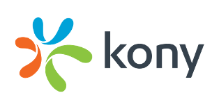
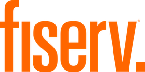

# Landscape:

* What domain of the financial industry is the company in?

Banno's primary focus is online/digital banking although to succeed in this landscape, incorporating other FinTech domains is essential. Jack Henry and Associates have strategically acquired two other FinTech companies, BOLTS Technologies and Geezeo, to position Banno for growth in this industry. BOLTS Technologies is a company that focuses on digital account opening for financial institutions, especially for deposit accounts;[^1] this acquisition allows for more people to be easily become members of a financial institution through the digital channel, which in turn drives online banking usage for the financial institution.  Geezeo is a personal financial management company, that empowers digital banking users to visualize their spending habits, set financial goals and budgets, and proactively intercede to help users to achieve better financial management;[^2] this acquisition helps to engage online banking users more, which further drives habitual use of the platform and overall adoption. Please note that my definition of digital banking for this case study is limited to the companies that provide technology to established financial institutions and not neobanks or other challenger banks.

* What have been the major trends and innovations of this domain over the last 5-10 years?

The most important change in this domain over the last decade has been the shift towards making the underlying online banking technology more extensible, developer friendly, and modern API based. Companies that have embraced this trend have seen more growth and overall the industry has been shifting towards this in response to neobanks, and other developer friendly FinTechs that are capable of integrating more easily with many different organizations. Q2 E-Banking created and released their SDK to aid in this transition in 2018.[^3] Kony has embraced an open integration architecture for nearly a decade now and use this strategy to drive business.[^4] Alkami has even launched a new FinTech partnership program for established FinTech companies to take advantage of their APIs and easy ability to integrate into their system, thus gaining access to hundreds of financial institutions. Banno's entire digital banking platform is API centric and open source, which has helped their ability to improve their overall solution, including rapidly integrating other acquisitions from Jack Henry and Associates, as mentioned before.

* What are the other major companies in this domain?

All of the companies listed below are the major players in the digital/online banking space, specifically targeting regional banks and credit unions across the United States.

Footnotes:
[1]: https://pitchbook.com/profiles/company/118629-64

[2]: https://finovate.com/jack-henry-acquires-geezeo/

[3]: https://www.bloomberg.com/press-releases/2018-08-14/q2-releases-caliper-sdk-enabling-customers-to-customize-and-extend-q2-platform

[4]: https://konydocs.atlassian.net/wiki/spaces/ARBD/pages/1081433586/Open+Integration

[5]: https://www.alkami.com/articles/alkami-launches-new-fintech-partnership-program/
